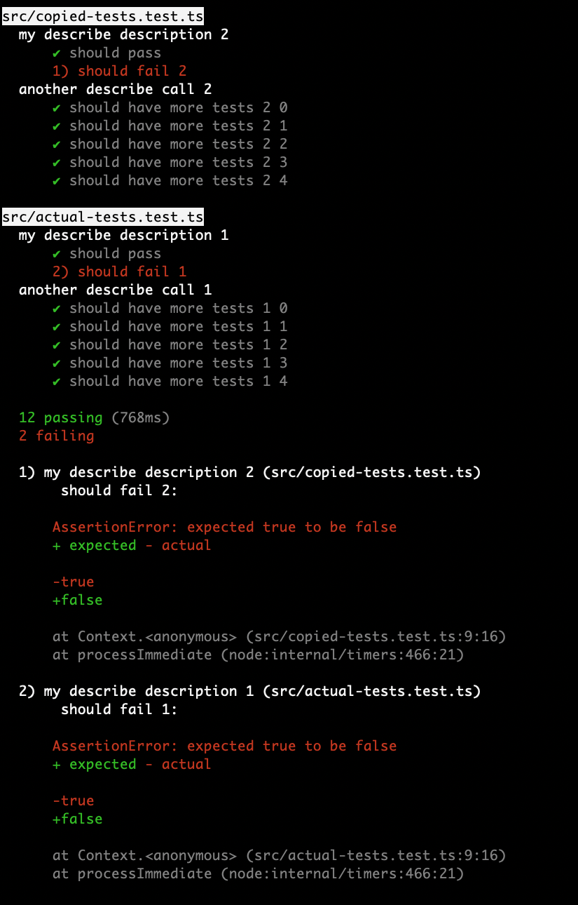

# mocha-spec-reporter-with-file-names

Modified version of the Mocha default built-in spec reporter but with file names included in the output.

Not currently tested very thoroughly.

Here's what the output looks like:



# Usage

## Config

```Javascript
// .mocharc.js

const SpecReporterWithFileNames = require('mocha-spec-reporter-with-file-names');

module.exports = {
    reporter: SpecReporterWithFileNames.pathToThisReporter,
};
```

[Mocha config file docs.](https://mochajs.org/#configuring-mocha-nodejs)

## CLI

```bash
npx mocha --reporter './node_modules/mocha-spec-reporter-with-file-names'
```

[Mocha `--reporter` docs.](https://mochajs.org/#-reporter-name-r-name)

# Dev

There are currently no automated tests. Run `npm test` to go through the manual test.
